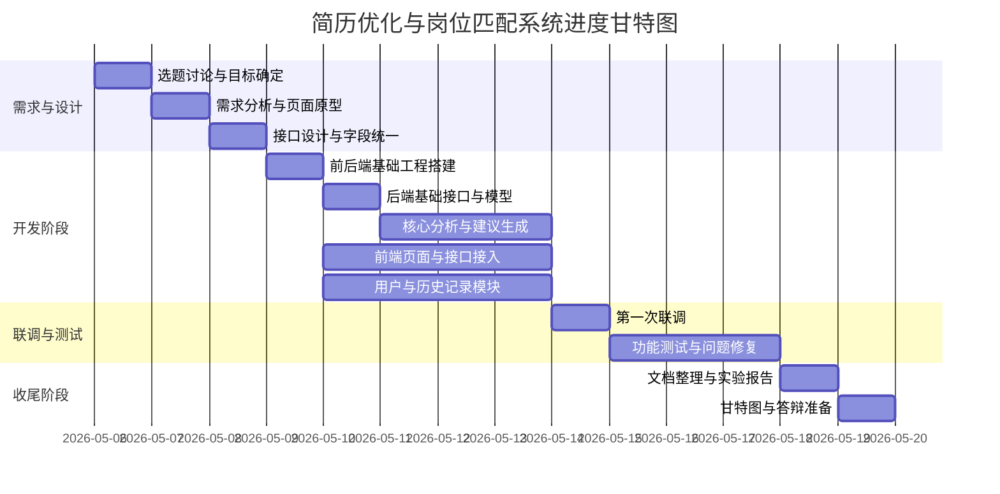

# 实验 1 软件项目的进度管理

## 项目名称

简历优化与岗位匹配系统

## 一、功能模块划分与三人分工

为了保证三个人的工作量比较均衡，并且便于协作推进，本项目采用如下模块划分方式：

| 模块名称 | 主要功能描述 | 负责人 | 相互关系及依赖说明 | 核心交付物 |
|---|---|---|---|---|
| 1. 需求分析与接口设计模块 | 明确系统功能范围、输入输出内容、页面流程和前后端 JSON 字段结构。 | 尹浩、邱梓涵 | 核心前置模块：作为整个项目的开发依据，是前端开发、后端开发和测试设计的共同基础。 | 完成需求说明、页面草图和接口字段定义。 |
| 2. 前端展示与交互模块 | 实现简历输入、岗位描述输入、分析按钮、结果展示和交互反馈。 | 尹浩 | 界面承载模块：依赖接口设计模块提供字段规范，依赖后端分析模块提供真实数据结果。 | 完成可交互的前端分析页面。 |
| 3. 后端接口与核心分析模块 | 实现请求接收、关键词提取、岗位匹配评分、优化建议生成和结果返回。 | 邱梓涵 | 逻辑中枢模块：处于关键路径上，既依赖前期接口设计，也为前端展示和历史记录模块提供核心数据支撑。 | 完成分析接口、评分逻辑和建议生成逻辑。 |
| 4. 用户与历史记录模块 | 实现登录注册、分析记录保存、历史结果查看等功能。 | 蒋灵炜 | 扩展支撑模块：依赖后端分析结果的数据结构，也需要和前端页面配合完成历史记录展示。 | 完成用户基础功能和历史记录功能。 |
| 5. 测试与文档整理模块 | 完成接口测试、功能测试、联调记录、README 和实验材料整理。 | 蒋灵炜 | 收尾保障模块：强依赖前面各模块按约定完成，负责验证数据流转是否正确并支撑最后提交。 | 完成测试记录、README 和实验报告整理。 |
| 6. 集成联调与问题修复模块 | 进行前后端联调、用户模块联调、问题修复和整体稳定性验证。 | 尹浩、邱梓涵、蒋灵炜 | 项目收口模块：依赖所有前期模块完成基础版本，确保从“输入简历”到“得到分析结果并保存记录”的完整流程跑通。 | 跑通系统主流程并完成关键缺陷修复。 |

这样的划分比较合理。尹浩主要负责前端和需求设计，邱梓涵主要负责后端核心分析，蒋灵炜主要负责用户功能、测试和文档整理，既能体现分工明确，也便于后期联调协作。

## 二、以天为单位的进度计划

本项目计划用 14 天完成，具体安排如下：

| 天数 | 工作内容 | 负责人 | 前置关系 |
|---|---|---|---|
| 第 1 天 | 三人讨论选题，明确项目目标、核心功能和最终展示内容 | 尹浩、邱梓涵、蒋灵炜 | 无 |
| 第 2 天 | 尹浩完成需求分析和页面原型草图，邱梓涵、蒋灵炜参与讨论并确认功能边界 | 尹浩主导 | 第 1 天 |
| 第 3 天 | 尹浩、邱梓涵一起完成接口字段设计，确定前后端 JSON 数据格式 | 尹浩、邱梓涵 | 第 2 天 |
| 第 4 天 | 邱梓涵搭建后端基础工程和接口结构，尹浩搭建前端页面框架，蒋灵炜搭建用户模块和测试目录 | 尹浩、邱梓涵、蒋灵炜 | 第 3 天 |
| 第 5 天 | 邱梓涵完成后端基础路由和数据模型，尹浩完成输入页面布局，蒋灵炜完成登录注册基础结构 | 尹浩、邱梓涵、蒋灵炜 | 第 4 天 |
| 第 6 天 | 邱梓涵实现简历解析、关键词提取和岗位匹配评分逻辑 | 邱梓涵 | 第 5 天 |
| 第 7 天 | 邱梓涵实现优化建议生成，尹浩完成结果展示页面，蒋灵炜实现历史记录基础功能 | 尹浩、邱梓涵、蒋灵炜 | 第 6 天 |
| 第 8 天 | 邱梓涵完成分析接口整合，尹浩开始前端调用接口，蒋灵炜完成用户和历史记录模块对接准备 | 尹浩、邱梓涵、蒋灵炜 | 第 7 天 |
| 第 9 天 | 尹浩、邱梓涵进行第一次前后端联调，检查字段、接口返回和页面展示 | 尹浩、邱梓涵 | 第 8 天 |
| 第 10 天 | 蒋灵炜开始接口测试和功能测试，邱梓涵修复后端问题，尹浩修复前端显示问题 | 尹浩、邱梓涵、蒋灵炜 | 第 9 天 |
| 第 11 天 | 蒋灵炜完成历史记录与主流程联调，尹浩优化交互细节，邱梓涵继续处理兼容问题 | 尹浩、邱梓涵、蒋灵炜 | 第 10 天 |
| 第 12 天 | 三人一起进行整体测试，集中修复影响演示的关键问题 | 尹浩、邱梓涵、蒋灵炜 | 第 11 天 |
| 第 13 天 | 蒋灵炜整理测试结果和 README，尹浩整理实验内容，邱梓涵配合补充技术说明 | 尹浩、邱梓涵、蒋灵炜 | 第 12 天 |
| 第 14 天 | 完成实验报告、甘特图和答辩准备 | 尹浩、邱梓涵、蒋灵炜 | 第 13 天 |

## 三、不同模块之间、不同人员之间的先后关系

本项目各模块之间具有明确的先后依赖关系，可以概括为：

需求分析与接口设计 -> 后端核心分析开发 -> 前端页面接入 -> 用户与历史记录接入 -> 集成联调与测试 -> 文档整理

### 1. 模块之间的先后关系

| 先后顺序 | 模块名称 | 依赖关系说明 |
|---|---|---|
| 1 | 需求分析与接口设计模块 | 整个项目的前置基础，必须先明确页面流程、输入输出和字段结构。 |
| 2 | 后端接口与核心分析模块 | 依赖需求分析和接口设计结果，为前端展示、历史记录和测试提供核心数据。 |
| 3 | 前端展示与交互模块 | 可以先搭页面框架，但真实联调必须依赖后端接口完成。 |
| 4 | 用户与历史记录模块 | 依赖后端分析结果结构，也依赖前端页面提供展示入口。 |
| 5 | 测试与文档整理模块 | 依赖前面模块完成基础功能后再进行集中测试和整理材料。 |
| 6 | 集成联调与问题修复模块 | 依赖所有模块具备可运行版本，负责打通完整业务流程。 |

### 2. 不同人员之间的先后关系

| 先后顺序 | 人员关系 | 依赖说明 |
|---|---|---|
| 1 | 尹浩 -> 邱梓涵 | 尹浩先完成需求分析和页面原型，邱梓涵才能细化后端接口结构和分析逻辑。 |
| 2 | 邱梓涵 -> 尹浩 | 邱梓涵完成分析接口和结果结构后，尹浩才能把前端页面接入真实数据。 |
| 3 | 邱梓涵 -> 蒋灵炜 | 邱梓涵输出稳定数据结构后，蒋灵炜才能完成历史记录的保存和展示逻辑。 |
| 4 | 蒋灵炜 -> 尹浩、邱梓涵 | 蒋灵炜在测试中发现问题后，需要反馈给尹浩和邱梓涵分别修改前后端。 |
| 5 | 全体成员协作 | 三个人完成各自模块后，再一起进行集成联调、问题修复和文档整理。 |

## 四、进度计划制定的合理性基础

| 序号 | 合理性基础 | 具体说明 |
|---|---|---|
| 1 | 符合软件开发流程 | 先分析需求，再设计接口，然后编码、联调、测试、整理文档，可以有效减少返工。 |
| 2 | 考虑模块依赖关系 | 前端依赖后端接口，历史记录依赖分析结果，测试依赖可运行版本，因此开发顺序不能颠倒。 |
| 3 | 三人任务量均衡 | 尹浩负责需求和前端，邱梓涵负责后端核心功能，蒋灵炜负责用户模块、测试和文档，分工比较均衡。 |
| 4 | 先主流程后扩展 | 优先保证“输入简历和岗位描述后得到分析结果”这条主流程稳定可演示。 |
| 5 | 预留联调修复时间 | 第 9 天到第 12 天用于联调、测试和修复，避免问题全部堆积到最后。 |

## 五、为完成进度计划采取的措施及突发情况处理方法

### 1. 为完成进度计划采取的措施

| 序号 | 保障措施 | 具体做法 |
|---|---|---|
| 1 | 统一需求和接口文档 | 开发前先确定输入输出和字段名称，减少前后端理解偏差。 |
| 2 | 明确个人分工 | 每个人负责自己模块的主要任务，在联调阶段再协同配合。 |
| 3 | 每天同步进度 | 每天汇报完成情况、当前问题和第二天计划，及时发现风险。 |
| 4 | 核心功能优先 | 先完成简历分析主流程，再完善历史记录、界面优化和文档整理。 |
| 5 | 尽早联调与测试 | 基础功能完成后立即联调和测试，不把问题拖到最后。 |

### 2. 突发情况处理方法

| 突发情况 | 处理方法 |
|---|---|
| 某位成员进度落后 | 先保证核心功能不受影响，必要时由其他成员协助完成关键部分。 |
| 前后端接口字段不一致 | 立即回到接口文档统一修改，避免各自随意变更。 |
| 后端核心功能实现难度过高 | 先保留基础评分和建议功能，复杂优化内容后置。 |
| 联调阶段出现大量报错 | 先解决接口无法调用、数据无法返回、页面无法展示等关键问题。 |
| 测试中发现较多缺陷 | 暂停新增功能，优先修复影响演示的核心问题。 |
| 时间不足 | 适当压缩非核心功能，优先保证主流程和实验报告按时完成。 |

## 六、甘特图

2026-05-06